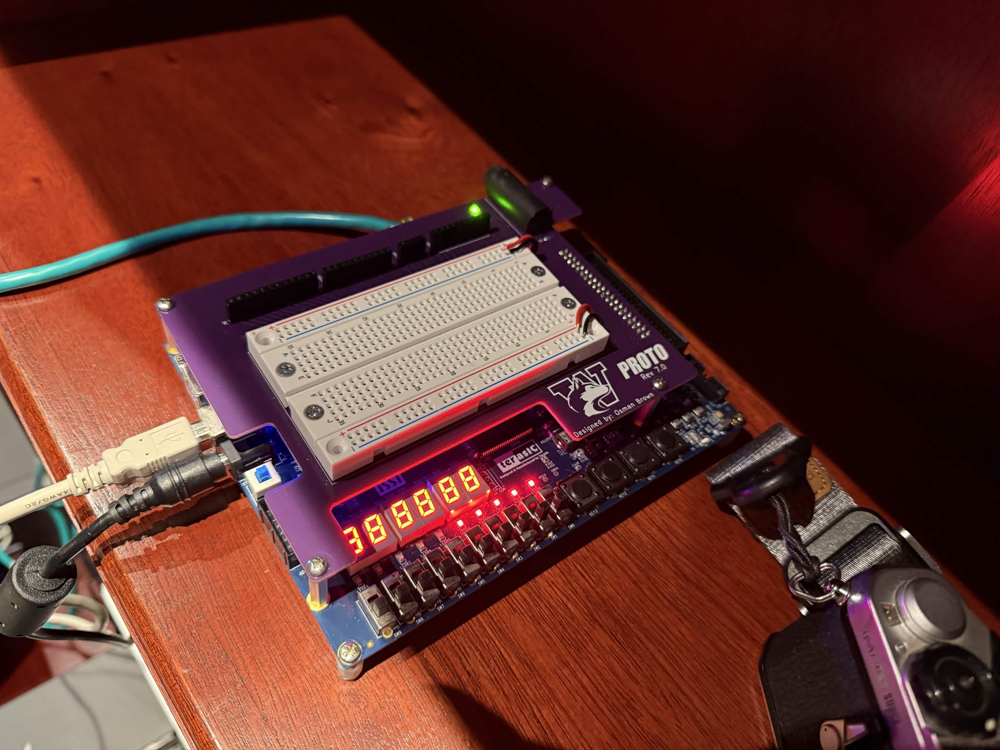
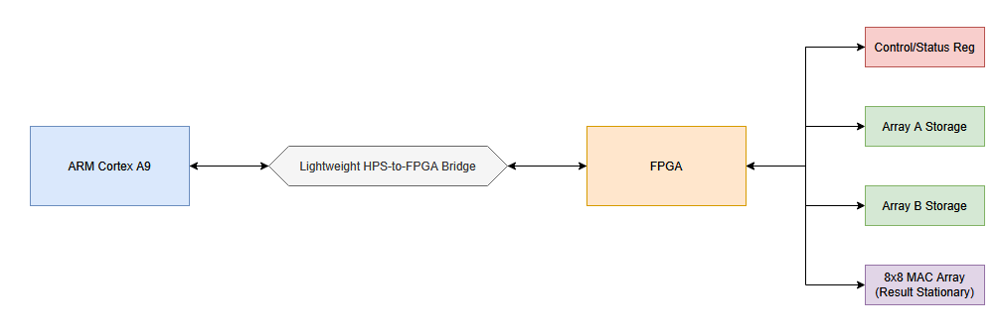

# INT8 GEMM Accelerator for the DE1-SoC

An INT8 matrix-multiplication accelerator implemented in SystemVerilog on the DE1-SoC, controlled by its ARM processor through Avalon-MM. Currently, this is a fixed 8x8 broadcast array, which has been successfully tested both in simulation and on the physical FPGA. In the future, I'll update it to a true systolic array, and improve handling of larger arrays.

## Demo and Current Results
- Correct 8x8 GEMM on DE1-SoC
- 64 parallel MAC units
- Signed int8 inputs and signed int32 outputs
- 50 MHz fabric clock
- 77.48 MHz reported fabric Fmax
- 64/87 DSP blocks used
- Approximately 2 µs for the ARM to issue start and poll until completion; input loading and output reading are excluded. The accelerator itself completes in nine 50 MHz fabric cycles.

[View the complete hardware run record](Results/8x8%20Broadcast%20Array/)

## Architecture

The accelerator computes $C = A * B$. During accumulation cycle k, it broadcasts column k of A and row k of B across the 8×8 MAC array; MAC (i,j) accumulates $A[i,k] * B[k,j]$. Because the A memory is read row-wise, software stores A transposed, while B remains row-major. One initialization cycle plus eight accumulation cycles produces the nine-cycle core latency. The ARM can write to the storage of the two arrays with 4 int8 numbers at a time. The final C array will contain 64 int32 numbers, which can be read one at a time. All 64 MACs in the array receive a row (from B) and a column (from A) every broadcast cycle, so counting one startup cycle the full process takes 9 clock cycles for an 8x8 array. Here's a basic word-addressed memory map:

- `register[0]`: ctrlwr [31:1 reserved, 0 start]. Write a 1 to bit 0 to start the calculations.
- `register[1]`: ctrlrd [31:2 reserved, 1 busy, 0 done]. When 1 is false and 0 is true, the calculation is done. When 1 is true, it's currently working. When neither is true, the machine is idle
- `register[2]`: ID. Reading this should always return 0xabcd0000. If it doesn't, something has gone wrong.
- `register[3]`: rwtest. Can be written to and read to test if the system is working.
- `register[15:4]`: reserved.
- `register[31:16]`: Matrix A, stored transposed. Words 16 and 17 contain logical column 0: word 16 holds A[0][0] through A[3][0], while word 17 holds A[4][0] through A[7][0]. Words 18 and 19 contain column 1, and so on.
- `register[47:32]`: Matrix B, stored row-major. Words 32 and 33 contain logical row 0: word 32 holds B[0][0] through B[0][3], while word 33 holds B[0][4] through B[0][7]. Words 34 and 35 contain row 1, and so on.
- `register[63:48]`: reserved.
- `register[127:64]`: matrix C. C[0][0] is 64, C[0][1] is 65, and so on.

## Verification

The accelerator was validated at four levels: a software reference model, RTL simulation, FPGA compilation and timing analysis, and execution on physical hardware.

### Golden reference model

`Python/golden_model.py` implements signed INT8 matrix multiplication using NumPy and produces exact signed INT32 results. The generated test data includes values such as `-128`, `127`, `0`, and `-1` to exercise signed-arithmetic edge cases. This script and the generated vectors serve as the reference for the RTL and hardware tests.

### RTL simulation

Individual SystemVerilog testbenches exercise the MAC, matrix storage, MAC array, and Avalon-MM slave. The integrated Avalon testbench performs 1,000 randomized register, memory, and idle operations before running a fixed seeded 8×8 GEMM. All 64 output values match the golden reference vector.

### FPGA compilation and timing

The complete DE1-SoC design successfully compiles and fits for the Cyclone V FPGA in Quartus Prime Lite 17.0. The accelerator uses all 64 intended DSP blocks. The design runs at a 50 MHz fabric clock, with TimeQuest reporting a worst-corner fabric Fmax of 77.48 MHz.

### Hardware validation

The ARM-side test program maps the lightweight HPS-to-FPGA bridge through `/dev/mem`, verifies the accelerator’s ID and read/write test registers, loads packed A and B matrices, starts the accelerator, polls its status, and compares all 64 returned values against the expected matrix.

The physical DE1-SoC test completed successfully with all 64 outputs matching. The ARM observed approximately 2 µs between issuing the start command and detecting completion; this measurement excludes loading the input matrices and reading the output matrix.

[View the hardware-run evidence and recorded result](Results/8x8%20Broadcast%20Array/)

## How to reproduce

To reproduce these results, you will need:
- A DE1-SoC. Mine is revision G and borrowed from the University of Washington, which shouldn't change much, but hardware is notoriously finicky so I'm mentioning it anyway.
- An image of Linux for the DE1-SoC. Mine came from [FPGAcademy](https://fpgacademy.org/tutorials#embeddedLinux-anchor).
- A GHRD for the DE1-SoC. I got mine from [Terasic](https://download.terasic.com/downloads/cd-rom/de1-soc/).
- Quartus Prime Lite, mine was version 17.0

After you have these, as well as the files in this repo, begin by flashing Linux onto the DE1-SoC and test that it worked with the default tests that come bundled with the image. Once it's functional, open the `.qpf` file in `de1_soc_GHRD`. You will need to regenerate the Qsys system. After that's done, compile the full design. This takes about 20 minutes, and should have 0 errors.

[A note about warnings](Results/8x8%20Broadcast%20Array/build_notes).

Next, open the programmer, and connect your blaster cable to the FPGA (Linux should be booted and on during this step). Go to processing -> auto detect, and select the version ending with MA. Two devices will pop up. Right click the one that ends in MA, select "change file" and select the `.sof` file that pops up as an option. Check the Program/Configure box, then hit program. After that, once you have the C files over on the ARM chip (I recommend `ssh`ing into your Linux terminal and using `scp`) you can compile and run them to test it out! The 8x8 test has the golden model arrays preloaded to it, so you can just run the program and it will test the array automatically. It needs to access `/dev/mem`, which typically requires root access. 

For the 8x8 test, I compiled using `gcc -std=gnu99 basic_8x8_test.c -o 8x8_test -lrt`. If you run into any trouble on these steps, please let me know!

## Repository structure

| Directory | Purpose |
| --- | --- |
| `C/Broadcast Array/` | ARM-side software for controlling and testing the current broadcast array. |
| `C/Testing files/` | C programs written during hardware bring-up and development. Some may now be obsolete. |
| `Images/` | Various images relevant to the repository. |
| `Python/vectors/` | Test vectors generated by `golden_model.py`. |
| `Python/golden_model.py` | Python script to generate a golden model of matrix multiplication to test against. Initially AI-generated, subsequently reviewed against included sanity and signed-arithmetic edge-case checks. |
| `Results/8x8 Broadcast Array/` | Evidence and recorded results from the successful 8×8 hardware test. |
| `Results/Systolic Array/` | Reserved for results from the future systolic implementation. |
| `Verilog/de1_soc_GHRD/` | Quartus project used to generate the DE1-SoC FPGA bitstream. It is based on Terasic’s DE1-SoC GHRD version 13.1.0 and integrates the custom RTL through Qsys. I made very few changes here. |
| `Verilog/rtl_sim/` | SystemVerilog modules and testbenches written for the accelerator. The Quartus files here were used as a simulation environment and do not generate the board’s final bitstream. |

## Current issues & Roadmap

At the moment, this repo holds a functioning 8x8 GEMM accelerator, but it is not yet a proper systolic array. The next major update I want to do is to fix that. Once I have a properly functioning systolic array, I'll also put a bit more work into the interface. Ideally, I'll add a C program that lets you more easily load hex files into the accelerator, and I'll make it much easier to do work with non 8x8 arrays. Currently, to do any work with arrays of different sizes, you need to do quite a bit of heavy lifting on the software side. It would be ideal if I could make this easier on the hardware side, but if not, I'll at least create a proper software interface to use as a blueprint. A rough roadmap for all of this:

- [X] Complete 8x8 broadcast array  
- [X] Verify on hardware (Completed August 2026)  
- [ ] Convert to a systolic array  
- [ ] Full interface completed and published  
- [ ] Final bug fixes and improvements, then this project is done!  

I'll also be doing a full writeup about my experience building this project. You can find the current version of it here: https://ae0lis.github.io/projects/gemm_accelerator/. This is still a provisional writeup, so expect some changes!

## Attribution

The accelerator RTL, testbenches, Avalon-MM slave, and ARM-side driver were all written by me. `Verilog/de1_soc_GHRD/` is mostly from Terasic’s DE1-SoC GHRD version 13.1.0, but I added the custom accelerator component and Qsys integration. golden_model.py was initially generated using Claude, though I did review it by hand to make sure the math checked out.
